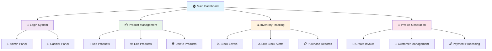
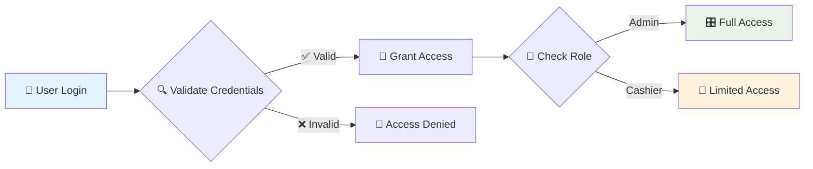
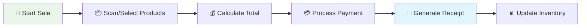
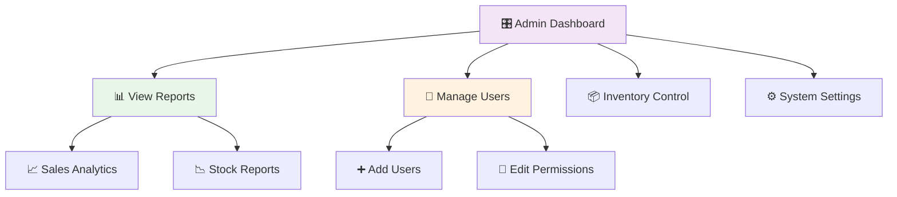
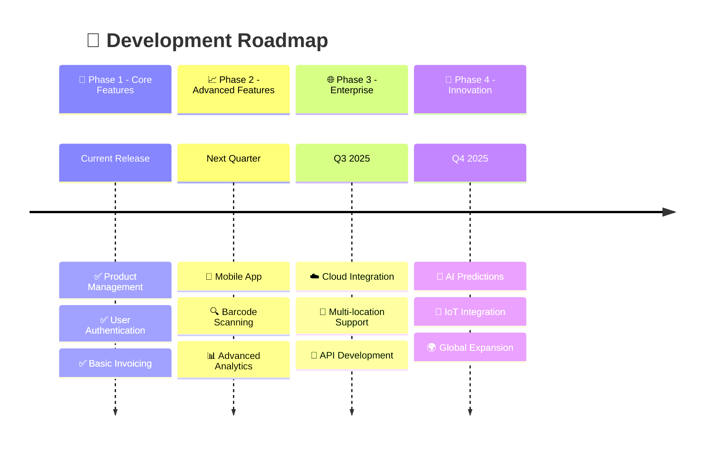

# 🏪 Inventory Management System (C# WPF)

<div align="center">


[](https://dotnet.microsoft.com/)
[](https://docs.microsoft.com/en-us/dotnet/csharp/)
[](https://docs.microsoft.com/en-us/dotnet/desktop/wpf/)
[](https://www.microsoft.com/en-us/sql-server)

[](https://github.com/anasraheemdev/Inventory-Management-C-/stargazers)
[](https://github.com/anasraheemdev/Inventory-Management-C-/network/members)
[](https://github.com/anasraheemdev/Inventory-Management-C-/issues)
[](https://github.com/anasraheemdev/Inventory-Management-C-/blob/main/LICENSE)

🎯 **A comprehensive inventory management system built with C# and WPF, designed to streamline product management, user administration, and sales tracking for businesses.**

[🚀 Getting Started](#-getting-started) • [📖 Documentation](#-key-components) • [🤝 Contributing](#-contributing) • [⭐ Star](#-inventory-management-system-c-wpf)

</div>

---

## 🌟 Features Overview

<table>
<tr>
<td>

### 🛍️ **Product Management**
- ✅ Add new products with detailed info
- ✅ Edit existing products by ID
- ✅ Real-time data synchronization
- ✅ Advanced product categorization
- ✅ Bulk operations support

</td>
<td>

### 👥 **User Management** 
- ✅ Role-based access control
- ✅ Admin & Cashier permissions
- ✅ Secure authentication system
- ✅ User activity tracking
- ✅ Account management portal

</td>
</tr>
<tr>
<td>

### 📊 **Inventory Tracking**
- ✅ Real-time stock monitoring
- ✅ Low stock alerts
- ✅ Purchase history tracking
- ✅ Automated inventory updates
- ✅ Stock movement reports

</td>
<td>

### 🧾 **Sales & Invoicing**
- ✅ Professional invoice generation
- ✅ Transaction history
- ✅ Customer management
- ✅ Payment processing
- ✅ Sales analytics dashboard

</td>
</tr>
</table>

---

## 🎨 User Interface Preview

<div align="center">



</div>

---

## 🛠️ Technology Stack

<div align="center">

| Category | Technology | Version | Purpose |
|----------|------------|---------|---------|
| 🖥️ **Framework** |  | 8.0 | Application Runtime |
| 🎨 **UI Framework** |  | Latest | User Interface |
| 🗄️ **Database** |  | 2022 | Data Storage |
| 🔧 **ORM** |  | 8.0 | Database Access |
| 🏗️ **Architecture** |  | - | Design Pattern |
| 💻 **Language** |  | 12.0 | Programming Language |

</div>

---

## 📁 Project Architecture

<details>
<summary>🔍 <strong>Click to expand project structure</strong></summary>

```
🏪 Inventory-Management-C-/
├── 📂 Models/                          # 🏗️ Data models and entities
│   ├── 📄 Product.cs                   # Product entity model
│   ├── 📄 User.cs                      # User management model
│   ├── 📄 Invoice.cs                   # Invoice data model
│   └── 📄 Stock.cs                     # Inventory tracking model
├── 📂 Views/                           # 🎨 XAML user interface files
│   ├── 📄 MainWindow.xaml              # 🏠 Main application window
│   ├── 📄 LoginPage.xaml               # 🔐 User authentication
│   ├── 📄 ProductsPage.xaml            # 📦 Product management
│   ├── 📄 AddProductPage.xaml          # ➕ Add new products
│   ├── 📄 Invoice.xaml                 # 🧾 Invoice generation
│   ├── 📄 StockTrackingWindow.xaml     # 📊 Inventory monitoring
│   └── 📄 ViewAllUsersWindow.xaml      # 👥 User management
├── 📂 ViewModels/                      # 🧠 Business logic layer
├── 📂 Utilities/                       # 🔧 Helper classes
│   └── 📄 AlternatingRowBackgroundConverter.cs
├── 📂 bin/                             # 🏗️ Compiled binaries
├── 📂 obj/                             # 🔨 Build objects
├── 📄 App.xaml                         # ⚙️ Application config
├── 📄 FinalDB.csproj                   # 📋 Project file
└── 📄 README.md                        # 📖 This file
```

</details>

---

## 🚀 Getting Started

### 📋 Prerequisites

<div align="center">

| Requirement | Version | Download Link |
|-------------|---------|---------------|
| 🪟 **Windows** | 10/11 | [Download](https://www.microsoft.com/windows) |
| 🔧 **.NET SDK** | 8.0+ | [](https://dotnet.microsoft.com/download) |
| 🗄️ **SQL Server** | 2019+ | [](https://www.microsoft.com/sql-server/sql-server-downloads) |
| 🛠️ **Visual Studio** | 2022 | [](https://visualstudio.microsoft.com/) |

</div>

### 📥 Installation Steps

<details>
<summary>🔧 <strong>Step-by-step installation guide</strong></summary>

#### 1️⃣ **Clone the Repository**
```bash
# 📥 Clone using HTTPS
git clone https://github.com/anasraheemdev/Inventory-Management-C-.git

# 📁 Navigate to project directory
cd Inventory-Management-C-
```

#### 2️⃣ **Setup Development Environment**
```bash
# 🔄 Restore NuGet packages
dotnet restore

# 🏗️ Build the solution
dotnet build
```

#### 3️⃣ **Database Configuration**
```bash
# 🗄️ Update database connection string in App.config
# 🔄 Run Entity Framework migrations
dotnet ef database update
```

#### 4️⃣ **Run the Application**
```bash
# 🚀 Start the application
dotnet run

# 🎯 Or use Visual Studio
# Press F5 or Ctrl+F5
```

</details>

---

## 🎯 Key Components

### 🔐 **Authentication System**

<div align="center">



</div>

- 🔒 **Secure Login**: Multi-factor authentication support
- 👑 **Role Management**: Admin, Cashier, and custom roles
- 🔐 **Session Control**: Automatic timeout and security
- 📝 **User Registration**: Streamlined onboarding process

### 📦 **Product Management Dashboard**

<table align="center">
<tr>
<td align="center">

**🏷️ Product Information**
- Name & Description
- SKU & Barcode
- Category & Brand
- Images & Specifications

</td>
<td align="center">

**💰 Pricing & Cost**
- Purchase Price
- Selling Price
- Profit Margins
- Bulk Pricing Tiers

</td>
<td align="center">

**📊 Stock Management**
- Current Quantity
- Minimum Stock Level
- Reorder Points
- Stock Locations

</td>
</tr>
</table>

### 🧾 **Advanced Invoice System**

<div align="center">

| Feature | Description | Status |
|---------|-------------|--------|
| 📄 **Invoice Creation** | Generate professional invoices | ✅ Active |
| 🎨 **Custom Templates** | Multiple invoice designs | ✅ Active |
| 💳 **Payment Tracking** | Multiple payment methods | ✅ Active |
| 📧 **Email Integration** | Send invoices via email | 🔄 Coming Soon |
| 📱 **Mobile Preview** | Responsive invoice view | 🔄 Coming Soon |

</div>

---

## 🎮 Interactive Usage Guide

<details>
<summary>🚀 <strong>First-Time Setup Wizard</strong></summary>

### 🎯 **Initial Configuration Steps**

1. **🚀 Launch Application**
   ```
   ┌─────────────────────────────────────┐
   │  🏪 Inventory Management System     │
   │                                     │
   │  👋 Welcome! Let's get started...   │
   │                                     │
   │  [ 🎯 Begin Setup ]                 │
   └─────────────────────────────────────┘
   ```

2. **👤 Create Admin Account**
   - Enter admin credentials
   - Set security questions
   - Configure system preferences

3. **🏪 Business Information**
   - Company name and details
   - Tax configuration
   - Currency settings

4. **📦 Initial Inventory**
   - Import existing products
   - Set up categories
   - Configure stock levels

</details>

<details>
<summary>💼 <strong>Daily Operations Guide</strong></summary>

### 🏬 **For Cashiers**


### 👑 **For Administrators**


</details>

---

## 🔥 Recent Updates & Changelog

<div align="center">

| 📅 Date | 🎯 Feature | 📝 Description | 🏷️ Status |
|---------|------------|----------------|-----------|
| **2 days ago** | 🔄 **Data Fetching** | Enhanced product section with real-time updates |  |
| **2 days ago** | ✏️ **Edit by ID** | Product editing functionality using unique IDs |  |
| **3 days ago** | 🗄️ **Database Integration** | Complete user registration and management |  |
| **1 week ago** | 🎨 **UI Improvements** | Consistent theming across all pages |  |
| **1 week ago** | 🔗 **Page Navigation** | All pages connected successfully |  |

</div>

---

## 🎯 Roadmap & Future Enhancements

<div align="center">



</div>

<details>
<summary>📋 <strong>Detailed Feature Roadmap</strong></summary>

### 🎯 **Immediate Priorities** (Next 30 Days)
- [ ] 📱 **Mobile Responsive Design**
- [ ] 🔍 **Advanced Search & Filters**
- [ ] 📊 **Enhanced Reporting Dashboard**
- [ ] 🔔 **Real-time Notifications**
- [ ] 💾 **Data Backup & Recovery**

### 📈 **Short-term Goals** (Next 3 Months)
- [ ] 📱 **Mobile App Development**
- [ ] 🎯 **Barcode Scanner Integration**
- [ ] 📧 **Email Automation**
- [ ] 🔗 **Third-party Integrations**
- [ ] 🌐 **Multi-language Support**

### 🚀 **Long-term Vision** (6-12 Months)
- [ ] ☁️ **Cloud Migration**
- [ ] 🤖 **AI-powered Analytics**
- [ ] 🏢 **Enterprise Features**
- [ ] 🔐 **Advanced Security**
- [ ] 🌍 **Global Deployment**

</details>

---

## 🤝 Contributing

<div align="center">

[](https://github.com/anasraheemdev/Inventory-Management-C-/graphs/contributors)

**🎉 We love contributions! Here's how you can help make this project even better:**

</div>

### 🌟 **Ways to Contribute**

<table>
<tr>
<td align="center">

### 🐛 **Bug Reports**
Found a bug? Let us know!
- Use issue templates
- Provide detailed steps
- Include screenshots
- Test environment info

[](https://github.com/anasraheemdev/Inventory-Management-C-/issues/new)

</td>
<td align="center">

### 💡 **Feature Requests**
Have a great idea?
- Describe the feature
- Explain the use case
- Provide mockups if possible
- Discuss implementation

[](https://github.com/anasraheemdev/Inventory-Management-C-/issues/new)

</td>
</tr>
<tr>
<td align="center">

### 🔧 **Code Contributions**
Ready to code?
- Fork the repository
- Create feature branch
- Write clean code
- Add tests if needed

[](https://github.com/anasraheemdev/Inventory-Management-C-/fork)

</td>
<td align="center">

### 📖 **Documentation**
Help improve docs!
- Fix typos
- Add examples
- Improve clarity
- Translate content

[](https://github.com/anasraheemdev/Inventory-Management-C-/edit/main/README.md)

</td>
</tr>
</table>

### 🔄 **Contribution Process**

```mermaid
gitgraph
    commit id: "🍴 Fork Repository"
    branch feature-branch
    checkout feature-branch
    commit id: "✨ Add New Feature"
    commit id: "🧪 Add Tests"
    commit id: "📝 Update Docs"
    checkout main
    merge feature-branch
    commit id: "🎉 Feature Merged!"
```

---

## 👨‍💻 Meet the Developer

<div align="center">


### **Anas Raheem** 🚀
*Full-Stack Developer & Software Engineer*

[](https://github.com/anasraheemdev)
[](https://linkedin.com/in/anasraheemdev)
[](https://anasraheemdev.github.io)
[](mailto:anasraheemdev@gmail.com)

*"Building efficient solutions for complex business problems"*

</div>

---

## 📞 Support & Community

<div align="center">

### 🤝 **Get Help**

| Platform | Purpose | Link |
|----------|---------|------|
| 🐛 **GitHub Issues** | Bug reports & Feature requests | [](https://github.com/anasraheemdev/Inventory-Management-C-/issues) |
| 💬 **Discussions** | Community support & Q&A | [](https://github.com/anasraheemdev/Inventory-Management-C-/discussions) |
| 📧 **Email Support** | Direct developer contact | [](mailto:anasraheemdev@gmail.com) |
| 📖 **Documentation** | Comprehensive guides | [](https://github.com/anasraheemdev/Inventory-Management-C-/wiki) |

### 📊 **Project Statistics**


</div>

---

## 📄 License

<div align="center">

This project is licensed under the **MIT License** - see the [LICENSE](LICENSE) file for details.

[](https://opensource.org/licenses/MIT)

*Free to use, modify, and distribute for personal and commercial projects*

</div>

---

<div align="center">

## 🌟 **Show Your Support**

**If this project helped you, please consider:**

[](https://github.com/anasraheemdev/Inventory-Management-C-/stargazers)
[](https://github.com/anasraheemdev/Inventory-Management-C-/fork)
[](https://github.com/anasraheemdev)

---

### 💝 **Thank you for your interest in our Inventory Management System!**


*Made with ❤️ by [Anas Raheem](https://github.com/anasraheemdev)*

</div>
